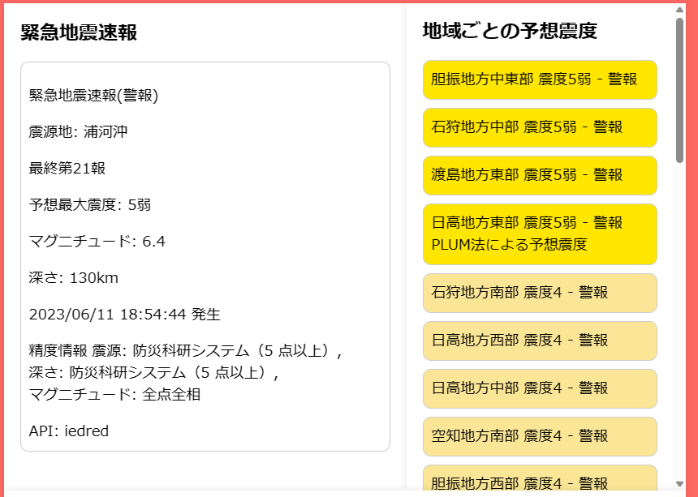
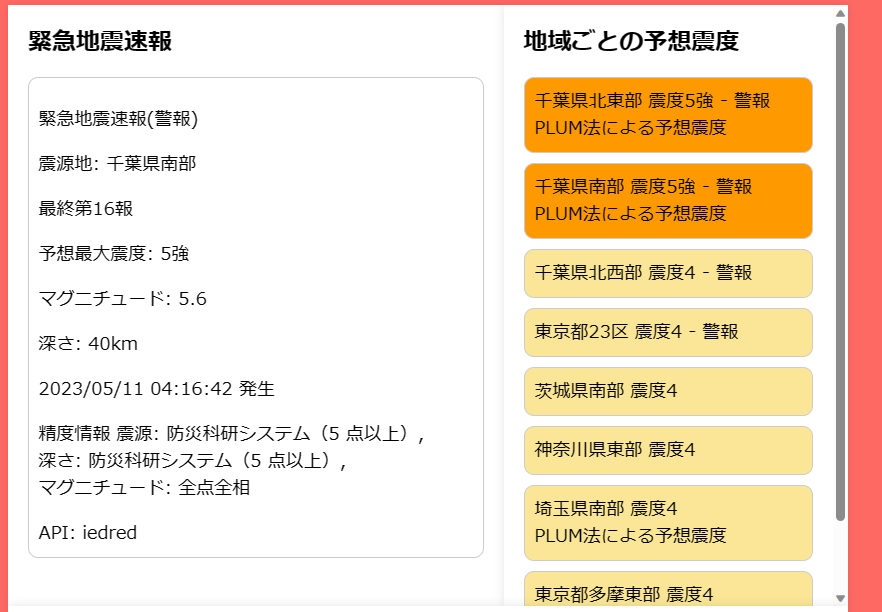

### EEW VIEWER
EEW VIEWERは、JavaScriptを使用したウェブサイトです。このサイトは、APIを情報源に、緊急地震速報と地震情報を表示しています。
   このwebアプリケーションはほとんどで***Bing AI***を使用し作成生成されているため、品質は保証していません。

### 特徴
- シンプルなデザイン
- スマートフォンやPCなど、ブラウザが動作するデバイスで利用可能
### eew-viewer-map について
- P波・S波の円も予報業務許可の対象になるという[情報](https://twitter.com/isidai/status/1676121747006033920)があったため、動向を確認するため一時的に2023年7月8日程度まで非公開にしています。
   申し訳ありません。
- またその情報はあくまで ***予報業務許可の対象になる***という話であり、許可が必要という意味ではないと思えますが
   念のため非公開にしています。
### 情報源
- 緊急地震速報: [api.wolfx ©Wolfx Studio](https://api.wolfx.jp), api.iedred7584.com
- 地震情報: [nTool Earthquake API Narikakun Network](https://nTool.online)
### 強震モニタの利用条件更新について
本webアプリケーションでは強震モニタから情報は一切取得していません。 
そのため、利用条件更新による影響はないと思われます。
### 注意事項
- 一部の情報は高度な緊急地震速報に関する知識が必要です。[緊急地震速報の特性や限界](緊急地震速報の特性や限界)を理解した上でご利用ください。
- このウェブサイトはほとんどでbing aiを使用し作成生成されているため、品質は保証しません。
- 利用先のAPIがメンテナンス中の場合は、受信・表示ができません。
- 取得して表示しているのは気象庁発表の情報です。
- 現在地の予想震度はJSONデータ内に含まれる地域ごとの予想震度を元に表示しています。
- このソースコード及びウェブサイトを使用したことによる、損害を制作者は一切負いません
### ソースコードの利用に関して
このウェブアプリケーションのソースコードを利用する場合、可能であれば[Twitter](https://twitter.com/rblxandmc)に連絡してください。

### 問題の報告
ウイルスやバグを発見した場合はissuesまたはTwitterに連絡していただけると幸いです。
